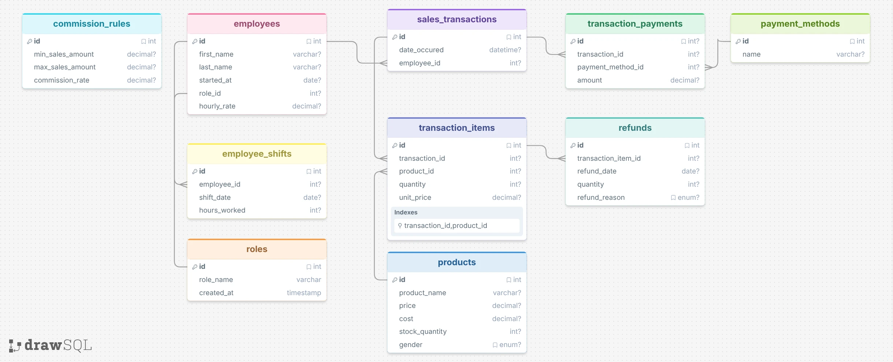

# Design Document

By Katherine Cevallos

Video overview: <https://youtu.be/JVYBeJFRNJ0>

## Scope

* What is the purpose of your database?

The purpose of this database is to help a clothing retail store manage its day-to-day operations and analyze business performance. The system stores information about products, employees, sales transactions, payment methods, refunds, commissions, and employee shifts. It allows managers to track sales, monitor inventory levels, analyze employee performance, calculate commissions, and identify trends in customer purchasing behavior.

* Which people, places, things, etc. are you including in the scope of your database?

The database includes:

Products: Contains all retail inventory items across both womenswear and menswear categories.
Employees: Lists all company personnel alongside their designated hourly pay rates.
Employee Roles: A reference table defining the job titles and roles within the company.
Employee Shifts: Tracks labor data by recording the specific date and total hours worked for each shift.
Sales Transactions: Records core sale events, capturing the transaction date and the employee responsible for the sale.
Transaction Items: Details the individual line items within a transaction, including the product ID, unit price, and quantity sold.
Payment Methods: A reference table listing accepted forms of payment.
Transaction Payments: Logs the financial settlement of sales, mapping the specific payment amounts to their respective payment method IDs.
Refunds: Tracks product returns by linking the specific transaction item ID to the quantity returned and the reason for the refund.
Commission Rules: Defines tiered compensation structures, mapping employee commission percentages to specific sales volume ranges.

* Which people, places, things, etc. are *outside* the scope of your database?

The following are outside the scope of this database:

- Customer information
- Supplier information
- Multiple store locations
- Payroll processing
- Marketing campaigns
- Employee leave management
- Product size and color variations

The database focuses on sales and operational analytics rather than complete enterprise retail management.

## Functional Requirements

In this section you should answer the following questions:

* What should a user be able to do with your database?

A user should be able to:

- Manage product information and inventory levels
- Record sales transactions
- Record multiple payment methods for a single transaction
- Process product refunds
- Track employee shifts and hours worked, and they can see if they worked on public holidays
- Calculate employee sales performance
- Determine employee commissions based on predefined commission tiers
- Analyze sales trends and business performance

* What's beyond the scope of what a user should be able to do with your database?

Users cannot:

- Manage customer accounts
- Track supplier relationships
- Generate employee payslips since we don´t have the goverment rules to make it, but it would be good to be the next step so we get to know if the commision were distributed correctly
- Handle online orders, it also would be a good next step to understand the online purchases and get to know if they are refunding those items
- Manage inventory across multiple store locations
- Track product variants such as sizes and colors and that would help in the future if the store receives new stock and if a customer needs to know if we have that size we can help them instead of looking for the item in the reserve

## Representation

### Entities

In this section you should answer the following questions:

* Which entities will you choose to represent in your database?
* What attributes will those entities have?
* Why did you choose the types you did?
* Why did you choose the constraints you did?

1. Roles.- The roles table stores employee job positions such as Sales Assistant or Store Manager.

Attributes:

id
role_name
created_at

Data Types:

- id is an INT because it uniquely identifies each role and supports auto-incrementing values.
- role_name is a VARCHAR(100) because role names vary in length and contain text.
- created_at is a TIMESTAMP to automatically record when the role was created.

Constraints:

- id is the primary key to uniquely identify each role.
- role_name is marked as UNIQUE to prevent duplicate role names.
- role_name is NOT NULL because every role must have a name.

2. Employees.- The employees table stores information about staff members.

Attributes:

id
first_name
last_name
started_at
role_id
hourly_rate

Data Types:

- id is an INT because it uniquely identifies each employee.
- first_name and last_name are VARCHAR(50) because employee names vary in length.
- started_at is a DATE because only the employment start date is required.
- role_id is an INT because it references the roles table.
- hourly_rate is a DECIMAL(10,2) to accurately store currency values.

Constraints:

- id is the primary key.
- role_id is a foreign key to maintain referential integrity with the roles table.
- hourly_rate must be greater than zero because employees cannot have a negative wage.
- Name fields are NOT NULL because every employee must have a recorded name.

3. Employee Shifts.- The employee_shifts table records employee working hours.

Attributes:

id
employee_id
shift_date
hours_worked

Data Types:

- id and employee_id are integers because they identify records and relationships.
- shift_date is a DATE because only the day of the shift is needed.
- hours_worked is a DECIMAL(5,2) to allow partial hours such as 7.5 hours.

Constraints:

- id is the primary key.
- employee_id is a foreign key referencing employees.
- hours_worked must be greater than zero.

4. Products.- The products table stores inventory information.

Attributes:

id
product_name
price
cost
stock_quantity
gender

Data Types:

- product_name is a VARCHAR(50) because product names vary in length.
- price and cost use DECIMAL(10,2) for accurate monetary calculations.
- stock_quantity is an INT because inventory is counted in whole units.
- gender is an ENUM because products can only belong to predefined categories.

Constraints:

- id is the primary key.
- product_name is unique to avoid duplicate product records.
- Price and cost must be greater than zero.
- Stock quantity cannot be negative.

5. Sales Transactions.- The sales_transactions table records individual sales.

Attributes:

id
date_occured
employee_id

Data Types:

- date_occured is a DATETIME because both the date and exact time of the sale are important for sales analysis.
- employee_id is an INT because it references the employee responsible for the sale.

Constraints:

- id is the primary key.
- employee_id is a foreign key to employees.
- date_occured is required because every transaction must have a timestamp.

6. Transaction Items.-The transaction_items table stores products sold within each transaction.

Attributes:

id
transaction_id
product_id
quantity
unit_price

Data Types:

- Foreign keys use INT.
- quantity is an INT because products are sold in whole units.
- unit_price is a DECIMAL(10,2) for accurate revenue calculations.

Constraints:

- Primary key on id.
- Foreign keys enforce valid transactions and products.
- Quantity must be greater than zero.

7. Payment Methods.-The payment_methods table stores accepted payment types.

Attributes:

id
name

Data Types:

- name is a VARCHAR(50) because payment method names are text values.

Constraints:

- Primary key on id.
- Payment method names should be unique.

8. Transaction Payments.-The transaction_payments table records how transactions were paid.

Attributes:

id
transaction_id
payment_method_id
amount

Data Types:

- IDs use integers.
- amount uses DECIMAL(8,2) to accurately store payment amounts.

Constraints:

- Primary key on id.
- Foreign keys ensure valid transactions and payment methods.
- Amount must be positive.

9. Refunds.-The refunds table records returned products.

Attributes:

id
transaction_item_id
refund_date
quantity
refund_reason

Data Types:

- refund_date uses DATETIME to record when the refund occurred.
- quantity is an integer because refunds occur in whole units.
- refund_reason is an ENUM because only predefined reasons are allowed.

Constraints:

- Primary key on id.
- Foreign key to the original transaction item.
- Quantity must be greater than zero.

10. Commission Rules.- The commission_rules table stores commission tiers.

Attributes:

id
min_sales_amount
max_sales_amount
commission_rate

Data Types:

- Monetary values use DECIMAL(8,2) for accuracy.
- Commission rates use DECIMAL(8,2) because percentages may contain decimal values.

Constraints:

- Primary key on id.
- Sales thresholds must be positive.
- Maximum sales amounts must be greater than minimum sales amounts.

### Relationships

One role can belong to many employees.
One employee can work many shifts.
One employee can process many sales transactions.
One sales transaction can contain many transaction items.
One product can appear in many transaction items.
One sales transaction can have many payments.
One payment method can be used in many payments.
One transaction item can generate many refunds.
One commission rule can apply to multiple employees based on sales performance.

## Optimizations

employee_shifts(employee_id)
sales_transactions(employee_id)
sales_transactions(date_occured)
transaction_items(transaction_id)
transaction_items(product_id)
products(gender)
transaction_payments(transaction_id)
transaction_payments(payment_method_id)
refunds(transaction_item_id)

These indexes improve performance for joins, filtering, and analytical queries such as sales reports, commission calculations, refund analysis, and product performance reporting.

## Limitations

One limitation is that the database does not store customer information. As a result, customer purchase history and loyalty programs cannot be analyzed.

The database also assumes a single store location and cannot track inventory across multiple branches.

Product variants such as sizes, colors, and styles are not represented, which may limit inventory analysis for larger retail operations.

Finally, commission calculations are based solely on sales revenue and do not consider factors such as refunds, attendance, or performance targets.

